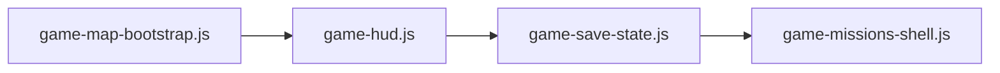

# Currency Safe — 工程排期（P3–P5）

> **课堂 UI**：[UI_ROADMAP.md](./UI_ROADMAP.md)（阶段 A–E ✅）  
> **玩法功能**：[IMPLEMENTATION_ROADMAP.md](./IMPLEMENTATION_ROADMAP.md)（队库 / 攻坚 / Bonus）  
> **后端部署**：[BACKEND_ROADMAP.md](./BACKEND_ROADMAP.md)（Postgres / Tunnel / QA）

**平台**：仅桌面 / 笔记本课堂（`min-width: 64rem`），不做手机 / 平板。

---

## 总览

| 阶段 | 主题 | 优先级 | 状态 |
|------|------|--------|------|
| **P3** | 技术债 / 架构 | 高 | 🔄 进行中 |
| **P4** | 玩法路线图（产品） | 中 | 📋 见 IMPLEMENTATION_ROADMAP |
| **P5** | 后端 / 课堂运维 | 中 | 📋 部分已有 |

---

## P3 — 技术债 / 架构

建议顺序：**成员同步 → 地图统一 → game 模块化 → 提交整理**。

| # | 项 | 说明 | 状态 |
|---|-----|------|------|
| P3-1 | **地图 pan/zoom 统一** | `js/map-viewport.js`；大厅 / 游戏 / 观战已接 | ✅ |
| P3-1b | 遗留单机 HTML | `currency_safe_world_map_ctf_singleplayer.html` 仍内联 pan/zoom；标记 legacy，或接 `map-viewport.js` | 📋 |
| P3-2 | **`memberIds` 单一真相** | `reconcileLobbyTeams` + `memberIdList()` 走 join/kick/assign/remove | ✅ |
| P3-3 | **`joinPlayerToTeamId`** | 与 `joinPlayerToState` 并列；local + WS handler 已接 | ✅ |
| P3-4 | **`game.html` 模块化** | 首步 `game-map-bootstrap.js`（viewport）；HUD / missions 待拆 | 🔄 |
| P3-5 | **E8 任务简报双语** | `howModal` 打开时 `applyToDocument()` | ✅ |
| P3-6 | **未提交改动整理** | KrackedMaps、大厅、顶栏、语言、map-viewport 等 → 单次或分批 commit | 📋 |

### P3-4 建议拆模块顺序

| 模块 | 职责 | 估时 |
|------|------|------|
| `game-map-bootstrap.js` | viewport、layout、pan/zoom 绑定 | 0.5d |
| `game-hud.js` | 顶栏 HUD、☰ 菜单、pill 刷新 | 0.5d |
| `game-save-state.js` | localStorage 存档 / 恢复 | 0.5d |
| `game-missions-shell.js` | 截获 Tab、向导条、renderMiniGames 调度 | 1d |

---

## P4 — 功能路线图（产品）

中长期玩法见 [IMPLEMENTATION_ROADMAP.md](./IMPLEMENTATION_ROADMAP.md)：

| 主题 | 阶段 |
|------|------|
| 队库经济深化 | Phase 1 |
| 关卡池 +2（颜色 / 碎片） | Phase 2 |
| 集体攻坚结算 | Phase 3 |
| 央行闪灯图钉 | Phase 4 |
| 阅读情报 Bonus | Phase 5 |
| 分队榜 + 个人榜 | Phase 6 |
| WebSocket 多端 QA | Phase 7 |
| UI/动效（B8 暂缓） | Phase 8 |

**试讲最小产品集**：Phase 1 + 2 + 3 可课堂闭环。

---

## P5 — 后端 / 课堂运维

| # | 项 | 说明 | 状态 |
|---|-----|------|------|
| P5-1 | **Postgres 课堂部署** | `docker compose` + `DATABASE_URL`；见 `scripts/start-classroom.ps1` | ✅ 脚本 |
| P5-2 | **Tunnel + QA** | `npm run qa` 冒烟；课前 `/health` | ✅ |
| P5-3 | **CI on PR** | 仓库暂无 `.github/workflows`；可加 `qa` job | 📋 |
| P5-4 | **房间自动清理** | lobby 空房 24h、ended 2h（`ROOM_*_MS` env） | ✅ |
| P5-5 | **房主手动删房** | 仅 ended / 空 lobby；`deleteRoom` API + 大厅按钮 | 📋 |
| P5-6 | **重连 / 多 tab** | `reconnectRoom` + `room-ws.js`；同浏览器多 tab 文档化 | 📋 |
| P5-7 | **进房令牌 UI** | 哈希存储已有；大厅 checkbox + 一次性明文展示 | ✅ |

### 课前检查清单（教师）

1. `docker compose up -d`（可选 Postgres）
2. `scripts/start-classroom.ps1` 或 `cd server && npm start`
3. 浏览器打开 `/health` → `storage: postgres` 或 `json`
4. `cd server && npm run qa`
5. Tunnel / 内网 IP 发给学生；提醒 **电脑浏览器 + 强刷**

---

## 文件索引

| 文件 | P3 相关 |
|------|---------|
| `js/map-viewport.js` | 共用 pan/zoom |
| `js/room-shared.js` | `memberIdList`, `syncTeamMemberIdsFromPlayers`, `joinPlayerToState`, `joinPlayerToTeamId`, `reconcileLobbyTeams` |
| `js/room-local.js` / `server/handlers/room-handlers.js` | join / kick / assign 应调用 reconcile |
| `game.html` | 待拆模块 |
| `scripts/start-classroom.ps1` | 一键课堂启动 |

---

## P6 — 细节打磨（可选）

| # | 项 | 状态 |
|---|-----|------|
| P6-1 | ☰ / 地图缩放 `aria-label` + Esc 关菜单 | ✅ |
| P6-2 | 音效统一 `csMuted`（首页 / 游戏 / 大厅 / 教程） | ✅ `js/portal-sound.js` |
| P6-3 | 首页卡片 `88rem` + 预览图增强（静态 SVG，不加载 live Kracked） | ✅ |
| P6-4 | `history.html` / `ended.html` 品牌 + i18n 顶栏 | ✅ |
| P6-5 | `tutorial.html` 顶栏与首页一致 | ✅ |

---

*文档版本：2026-06-29*
