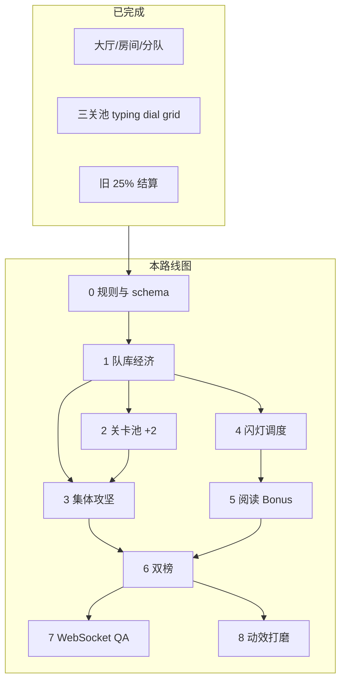

# Currency Safe — 实施排期（总路线图）

> **玩家规则**：[ROOM_RULES.md](./ROOM_RULES.md)  
> **UI 打磨**：[UI_ROADMAP.md](./UI_ROADMAP.md)  
> **工程 / 技术债**：[ENGINEERING_ROADMAP.md](./ENGINEERING_ROADMAP.md)  
> **已完成分队/央行基础**：[TEAM_BANK_ROADMAP.md](./TEAM_BANK_ROADMAP.md)（Phase 1–5 ✅）

---

## 总览



| 阶段 | 主题 | 工期 | 优先级 | 状态 |
|------|------|------|--------|------|
| **0** | 规则定稿 & 数据结构 | 1–2 天 | P0 | ✅ 文档 |
| **1** | 队库经济 | 3–5 天 | P0 | 📋 |
| **2** | 关卡池：颜色 + 碎片 | 5–7 天 | P0 | 📋 |
| **3** | 集体攻坚结算 | 4–6 天 | P0 | 📋 |
| **4** | 央行闪灯图钉 | 3–4 天 | P0 | 📋 |
| **5** | 阅读情报 Bonus | 5–7 天 | P0 | 📋 |
| **6** | 分队榜 + 个人榜 | 2–4 天 | P1 | 📋 |
| **7** | WebSocket 多端 QA | 4–6 天 | P1 | 📋 |
| **8** | UI/动效打磨 | 2–3 天 | P2 | 📋 |
| **9** | 品质打磨（逐关精修） | 持续 | P1 | ✅ 首批完成 |

**合计**：约 **4–7 周**（单人）；两人并行约 **3–4 周**。

---

## 建议周计划

| 周 | 交付物 |
|----|--------|
| W1 | Phase 1 队库可玩；HUD 显示队库 |
| W2 | Phase 2 颜色关 + 碎片关进池，随机三关可抽到 |
| W3 | Phase 3 集体攻坚；Phase 4 闪灯骨架 |
| W4 | Phase 5 阅读 Bonus 可赚钱进队库 |
| W5 | Phase 6 双榜；Phase 7 测试清单 |
| W6 | Phase 7 WebSocket QA；Phase 8 动效；课堂试讲 |

**可并行**：Phase 2（关卡 UI）∥ Phase 4（闪灯调度）；Phase 5 依赖 Phase 4 入口。

---

## Phase 0 — 规则 & Schema ✅

### 交付

- [x] `ROOM_RULES.md` 重写
- [x] `IMPLEMENTATION_ROADMAP.md`（本文件）
- [x] `MISSION_DESIGN.md` 玩法规格

### 数据结构（实现对照）

```ts
// room
{
  teams: [{
    id, stateId, memberIds[], state, mapX, mapY,
    vaultBalance: number,      // 队库（主余额）
    password?, passwordUpdatedAt?
  }],
  bank: { balance, password?, passwordUpdatedAt?, mapX?, mapY? },
  bankBonus: {
    waveIndex: number,
    nextFlashAt: number,       // ms timestamp
    phase: "hidden"|"arrive"|"breathe"|"depart",
    phaseEndsAt: number,
    completions: { playerId, teamId, amount, at }[]  // 本波已结算
  },
  targetRaids: {
    [targetTeamId]: {
      lootCapPercent: number,  // 25-40
      lootPotRemaining: number,
      activeAttackers: { playerId, teamId, joinedAt }[],
      completed: { playerId, teamId, amount, mistakes, at }[]
    }
  },
  playerStats: {
    [playerId]: { raidEarned: number, bonusEarned: number }
  },
  teamDeployCounts, players, ...
}
```

### 待拍板（实现前确认）

| # | 问题 | 建议默认 |
|---|------|----------|
| 1 | 新队初始队库 | RM **1,000** / 队 |
| 2 | 攻坚中点央行 | 须 **完成或放弃** 当前 intel |
| 3 | 央行余额不足 Bonus 池 | `min(掷骰, bank.balance)`，最低 0 |
| 4 | 旧存档迁移 | `ensureTeams()` 时合并旧 `player.balance` → 队库 |

---

## Phase 1 — 队库经济（3–5 天）

### 任务

| ID | 任务 | 文件 |
|----|------|------|
| 1.1 | `team.vaultBalance` 创建与默认 | `room-shared.js`, backends |
| 1.2 | 废弃个人余额入账；迁移逻辑 | `room-local.js`, `server/handlers/` |
| 1.3 | `applyTransfer`：队库 ↔ 队库 | `room-shared.js` |
| 1.4 | `teamBalance()` → `vaultBalance` | `room-shared.js` |
| 1.5 | HUD / 地图 / 大厅显示队库 | `game.html`, `lobby.html`, `spectator.html` |
| 1.6 | 交易记录 `fromTeamId` / `toTeamId` | backends |

### 验收

- [ ] 无任何路径增加 `player.balance` 战利品
- [ ] 同队成员看到相同队库
- [ ] 攻州转账后目标队库减少、攻者队库增加

---

## Phase 2 — 关卡池扩展（5–7 天）

### 新玩法规格

见 [MISSION_DESIGN.md](./MISSION_DESIGN.md)。

### 任务

| ID | 任务 | 文件 |
|----|------|------|
| 2.1 | `mastermind` generator + UI | `js/mission-mastermind.js`, `game.html` |
| 2.2 | `fragsort` generator + UI | `js/mission-fragsort.js`, `game.html` |
| 2.3 | REGISTRY `enabled: true`（池 ≥5） | `js/mission-games.js` |
| 2.4 | 各关 `mistakes` 上报到 intel | `game.html` |
| 2.5 | `MissionGames.setGenerators` 注册 | `game.html` |
| 2.6 | i18n | `js/i18n.js` |

### 验收

- [ ] 部署外队目标 → 随机 3 关可含 mastermind / fragsort
- [ ] 三关 solved → `reveal` 拼接与现网一致
- [ ] 竞赛同队同目标种子一致

---

## Phase 3 — 集体攻坚（4–6 天）

### 任务

| ID | 任务 | 文件 |
|----|------|------|
| 3.1 | `targetRaids` CRUD | `room-shared.js`, backends |
| 3.2 | 首次 deploy 掷 P、初始化池 | `claimTeamDeploy` 或新 hook |
| 3.3 | join / complete / 剩余池平分 | backends |
| 3.4 | `computeRaidPayout(share, mistakes)` | `room-shared.js` |
| 3.5 | 替换 `computeMissionScorePercent` 用于 PvP 攻坚 | `game.html` |
| 3.6 | Activity 文案 | backends |

### 公式

```
share = lootPotRemaining / activeCount
payout = round(share * max(0, 1 - mistakes/20))
lootPotRemaining -= payout
```

### 验收

- [ ] 2 人攻坚：约各半；先完成者锁定份额
- [ ] 第 3 人中途加入：仅分剩余池
- [ ] 失误 4 次：×0.8

---

## Phase 4 — 央行闪灯（3–4 天）

### 任务

| ID | 任务 | 文件 |
|----|------|------|
| 4.1 | `bankBonusPin` 海域坐标 | map config / `malaysia-states.js` |
| 4.2 | `BankBonusScheduler` 波次 | `js/bank-bonus-scheduler.js`（新） |
| 4.3 | 三阶段：arrive 3s / breathe / depart 3s | `game.html`, CSS |
| 4.4 | 仅 phase≠hidden 可点击 | `game.html` |
| 4.5 | 有 intel 时禁止或提示放弃 | `game.html` |
| 4.6 | 观战同步 phase | `spectator.html` |

### 节奏常量

```js
const BANK_FLASH = {
  practice: { intervalMs: 120_000, breatheMs: 12_000, firstDelayMs: 120_000 },
  competitive: { intervalMs: 240_000, breatheMs: 9_000, firstDelayMs: 240_000 },
  arriveMs: 3_000,
  departMs: 3_000
};
```

### 验收

- [ ] 练习 2:00 闪 18s；4:00 再来
- [ ] 竞赛 4:00 闪 15s；8:00 再来
- [ ] 攻州三关不被打断

---

## Phase 5 — 阅读情报 Bonus（5–7 天）

### 任务

| ID | 任务 | 文件 |
|----|------|------|
| 5.1 | `intelread` UI（通知 + 3 题） | `js/mission-intelread.js`, `game.html` |
| 5.2 | 题库 JSON（10–20 套） | `data/intel-briefings.json`（新） |
| 5.3 | 奖金池 UI + 扣款计时 | `game.html` |
| 5.4 | `completeBankBonus` 原子扣央行 → 队库 | backends |
| 5.5 | 每波每人一次有钱尝试 | `room.bankBonus` |
| 5.6 | `playerStats.bonusEarned` | backends |
| 5.7 | 断开央行旧三关路径 | `game.html` `isBankTarget` 分支 |

### 扣款常量

```js
const BONUS_LOOT = {
  poolMin: 2000, poolMax: 5000, poolStep: 100,
  graceMs: 20_000,
  timeTickMs: 5_000, timePenalty: 50,
  wrongPenalty: 200,
  floor: 200
};
```

### 验收

- [ ] 闪灯内点图钉 → 阅读 → 全对 → 队库增加、央行减少
- [ ] 扣款公式与 ROOM_RULES 一致
- [ ] 同波第二次有钱尝试被拒绝（可练读）

---

## Phase 6 — 双榜（2–4 天）

| ID | 任务 | 文件 |
|----|------|------|
| 6.1 | 局内分队榜 / 个人榜 | `game.html` |
| 6.2 | `ended.html` 颁奖双榜 | `ended.html` |
| 6.3 | 观战双榜 | `spectator.html` |
| 6.4 | CSV / 报告 | backends |

### 验收

- [ ] 分队按 `vaultBalance`；个人按 `raidEarned + bonusEarned`

---

## Phase 7 — WebSocket 多端 QA（4–6 天）

### 任务

- `targetRaids`、`bankBonus`、`vaultBalance` 事务与 subscribe
- `phaseEndsAt` 多端对齐
- 大厅组队 / `joinRoomAsPlayer(teamId)` 全路径回归

### 测试清单

- [ ] 主页仅房间码 → 大厅登记 → 开赛
- [ ] 随机三关含新玩法
- [ ] 多人同攻一州：固定 RM 250 + 失误 −30
- [ ] 闪灯自愿、错过、再闪
- [ ] Bonus 扣款进队库
- [ ] 双榜正确
- [ ] 双标签 / 双设备（WebSocket 服务器开时）

---

## Phase 8 — 动效打磨（2–3 天）

- 进场/离场闪 ~2–3 Hz，3s
- 呼吸光晕 1.5–2s 周期
- 阅读：打字机 + 咖啡渍纸
- 扣款数字动画；全对金光（`fx.js`）

---

## Phase 9 — 品质打磨（逐关精修）🔄

> 原则：**不求快，求品质**；每关单独验收后再进下一项。

| # | 模块 | 文件 | 内容 | 状态 |
|---|------|------|------|------|
| 9.1 | quantum | `js/mission-quantum.js`, `game.html` | 闪烁可见性、逐格音效、错题自动重播、节奏放慢 | ✅ |
| 9.2 | finale 熔炉 | `js/mission-finale.js` | 种子随机目标颜色序、逐字上色、ink 按种子重建 | ✅ |
| 9.3 | Bonus 陷阱 | `data/intel-briefings.json`, `mission-intelread.js` | 4 套陷阱简报、ATTENTION 标签、答错 Toast | ✅ |
| 9.4 | dial | `game.html` | 匹配震动/弹动、距离点、▲▼、坐标遮蔽 | ✅ |
| 9.5 | cvfilter | — | 已移除（移出随机池） | ✅ |
| 9.6 | typing | `game.html` | 焦点陷阱与错题统计口径复核 | ✅ |
| 9.7 | grid | `game.html` | 侦察/扫描节奏与口播对齐 | ✅ |
| 9.8 | mastermind | `js/mission-mastermind.js`, `game.html` | 六色可见、行数用尽提示与灯泡动效 | ✅ |
| 9.9 | 文档 | `ROOM_RULES.md` | 规则与实现同步 | ✅ |
| 9.10 | 大厅 UX | `lobby.html`, `room-*.js` | 只填名称、候场、点空位进州、离队换位 | ✅ |
| 9.11 | 央行 Bonus | `game.html`, `room-*.js` | 面板打开后才占有偿次数；加载失败 Toast | ✅ |
| 9.12 | 攻州夺取 | `game.html`, `room-shared.js` | 固定 RM 250 + 失误 −30；无集体奖池 | ✅ |

---

## 文件索引

| 文件 | 阶段 |
|------|------|
| `ROOM_RULES.md` | 0 |
| `MISSION_DESIGN.md` | 0, 2, 5 |
| `IMPLEMENTATION_ROADMAP.md` | 0 |
| `js/room-shared.js` | 1, 3, 5 |
| `js/room-local.js`, `server/handlers/room-handlers.js` | 1, 3, 5, 7 |
| `js/mission-games.js` | 2 |
| `js/mission-mastermind.js` | 2 新 |
| `js/mission-fragsort.js` | 2 新 |
| `js/mission-intelread.js` | 5 新 |
| `js/bank-bonus-scheduler.js` | 4 新 |
| `data/intel-briefings.json` | 5 新 |
| `game.html` | 1–5, 8 |
| `lobby.html`, `ended.html`, `spectator.html` | 1, 6 |

---

## 风险

| 风险 | 缓解 |
|------|------|
| 队库迁移破坏旧房 | 版本号 `roomSchemaVersion` + 一次性迁移 |
| 闪灯时间客户端漂移 | 以 `room.bankBonus.phaseEndsAt` 为准 |
| 集体攻坚并发转账 | 后端事务 / 乐观锁重试 |
| 池子 kind 不足 3 | `pickMissionKindIds` 已校验；保持 enabled≥5 |
