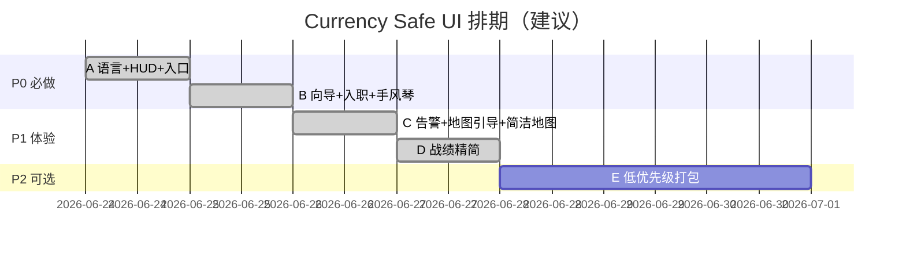

# Currency Safe — 课堂 UI 打磨排期

> 目标：降低新手认知负担，统一中英体验（每人自选语言），窄屏可用，教师观战与玩家界面分工清晰。

---

## 总览

| 阶段 | 主题 | 优先级 | 状态 |
|------|------|--------|------|
| **A** | 语言 + HUD 瘦身 + 顶栏入口 | P0 | ✅ 已实现 |
| **B** | 截获任务向导 + 入职缩短 | P0 | ✅ 已实现 |
| **C** | 密码告警 + 地图引导 + 简洁地图 | P1 | ✅ 已实现（Host 地图特效开关见 D） |
| **D** | 战绩精简 + 观战分工 | P1 | ✅ 已实现 |
| **E** | 低优先级体验 + CSS 统一 | P2 | 📋 排期中 |

---

## 阶段 A — 语言与顶栏（P0）

### A1. 大厅语言选择（每人自选，进游戏锁定）

| 项 | 说明 |
|----|------|
| **需求** | 学生在 `lobby.html` 选 **中文** 或 **English**；进入 `game.html` 后不可改，避免课堂中途误切 |
| **实现** | `js/i18n.js` + 大厅 `langZh` / `langEn` 按钮；`startGame` / 进入游戏中 `lockLang()` |
| **存储** | `sessionStorage`: `csUiLang`, `csUiLangLocked` |
| **后续** | `spectator.html`、`index.html` 静态文案可接同一套 `data-i18n` |

### A2. 顶栏 HUD 从 7 项减到 4 项

| 保留 | 收起至「⋯」 |
|------|-------------|
| 比赛时间 | 房间码 |
| 余额 | 模式（练习/竞赛） |
| 密码倒计时 | 其他玩家数量 |
| 当前目标 | — |

地图底部 `stat-mini`（Total money / Current target 等）已隐藏，信息合并进顶栏。

### A3. 返回大厅 + 任务简报

顶栏左侧：`返回大厅`（链回 `lobby.html?room=…`）、`任务简报`（原有 modal）、`音效` 开关。

**验收**：窄屏顶栏 ≤2 行；英文/中文标签与 `CurrencySafeI18n.t()` 一致。

---

## 阶段 B — 截获任务与入职（P0）

### B1. 入职流程缩短

| 场景 | 行为 |
|------|------|
| 大厅已 Join + 有队名/州属 | 默认打开 **截获任务** Tab，隐藏「确认密码」Tab（若房间已有密码则自动恢复） |
| 入职页 | 仅 **密码 + 特工等级**；州属只读展示 `playerStateDisplay` |

### B2. 截获任务分步向导

顶部固定三步条：

```
① 选目标 → ② 闯关 → ③ 破解转账
```

当前步骤高亮；已完成步骤标记 `done`。

### B3. 关卡手风琴

| 规则 | 说明 |
|------|------|
| 已完成关卡 | 收成一行摘要（`mission-collapsed`），点击可展开 |
| 当前关卡 | 自动展开并 `scrollIntoView` |
| 部署任务后 | 刷新情报时滚到当前关 |

**验收**：1080p 笔记本一屏能看到「现在该点哪」；新部署后无需手动找关卡。

---

## 阶段 C — 告警与地图（P1）

### C1. 密码倒计时视觉

| 条件 | 样式 |
|------|------|
| &lt; 2 分钟 | 顶栏 pill 琥珀色 `pill-warn` |
| 已过期 | 红色 + 脉冲 `pill-danger` |

### C2. 侧边栏常驻告警条

`#sidebarAlertBar`：过期 / 被转账 / 被迫换密码（不只 Toast）。

过期时自动切到 **金库防线** Tab；Tab 角标红点闪烁。

### C3. 地图交互引导

| 状态 | UI |
|------|-----|
| 未选目标 | 地图中央提示层「点击其他玩家金库…」 |
| 已选目标 | 默认显示淡色 intercept 弧线（目标 → 你） |

### C4. 练习模式简洁地图

| 模式 | 地图特效 |
|------|----------|
| 练习 `practice` | 关攻击动画、扫描线（`map-calm`） |
| 竞赛 `competitive` | 保持动感 |

`room.settings.mapEffects` 已在 `room-shared.js` 预留；**Host 大厅开关**列入阶段 E。

**验收**：密码过期后 3 秒内学生能看到告警条 + 防线 Tab；练习课不抢注意力。

---

## 阶段 D — 战绩与分工（P1）

### D1. 玩家战绩 Tab 精简

- **本房排名**（含自己）
- **最近 5 笔转账**（原 20 笔改为 5）

完整 Activity 链路由 `spectator.html` + 教师 CSV/报告导出承担。

### D2. 观战 vs 玩家

| 角色 | 界面 |
|------|------|
| 玩家 `game.html` | 操作 + 简版战绩 |
| 观战 `spectator.html` | 地图 / 排行榜 / Activity 全量 |

**验收**：学生不会在游戏内找「全班 Activity」；教师用观战页或导出。

---

## 阶段 E — 低优先级打磨（P2）

建议按课堂反馈分批，每批 0.5–1 天。

| # | 项 | 说明 | 估时 |
|---|-----|------|------|
| E1 | 图钉可读性 | 西马密集区：默认圆点，hover 放大 + 标签 | 0.5d |
| E2 | 密钥片段 | 未完成 🔒，完成高亮片段（已在 fragments 部分实现） | 0.25d |
| E3 | 小游戏文案 i18n | `renderTypingGame` 等动态 HTML 接入 `t()` | 1d |
| E4 | Host「地图特效」开关 | `lobby` checkbox → `setMapEffects()` | 0.5d |
| E5 | 色弱友好图钉 | 黄/绿/红加形状区分（player 方、target 菱形） | 0.5d |
| E6 | `game.html` CSS → `shared.css` | 抽门户共用变量与按钮，减重复 | 1–2d |
| E7 | `spectator.html` i18n | 与玩家语言 session 同步 | 0.5d |
| E8 | `howModal` 双语 | 任务简报正文按语言切换 | 0.5d |

---

## 建议落地顺序（给开发/试讲）



**试讲前最小集**：A + B + C1/C2（告警）  
**正式比赛前**：+ C3/C4 + D  
**有余力**：E 按反馈挑选

---

## 文件索引

| 文件 | 变更 |
|------|------|
| `js/i18n.js` | 中英文案、`lockLang`、`applyToDocument` |
| `lobby.html` | 语言选择、开局锁定 |
| `game.html` | HUD、告警、向导、手风琴、地图提示、静音 |
| `js/room-shared.js` | `settings.mapEffects` 默认值 |
| `spectator.html` | （E7）待接 i18n |
| `css/shared.css` | （E6）待合并样式 |

---

## 课堂操作提示（给教师）

1. 进大厅后提醒学生：**先选界面语言**（中文/English），再 Join。
2. 比赛开始后语言不可改；需要换语言的学生退出重进大厅（比赛未开始时）。
3. 练习课用 **Practice** 模式 → 地图自动简洁、部署不限。
4. 观战链接：`spectator.html?room=房间码` — 投影用，学生主界面保持 `game.html`。

---

*文档版本：2026-06-24 · 与当前仓库实现同步*
